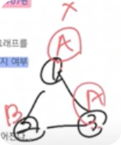
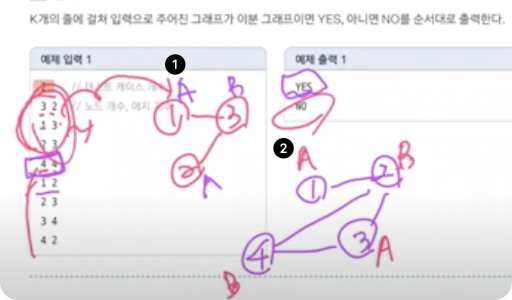
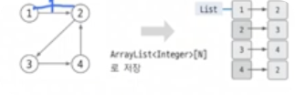
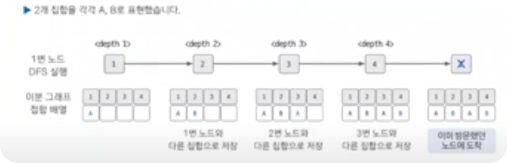

# 문제

[백준 1707번 - 이분 그래프](https://www.acmicpc.net/problem/1707)

## 문제 해석

`그래프의 정점의 집합을 둘로 분할하여, 각 집합에 속한 정점끼리는 서로 인접하지 않도록 분할할 수 있을 때, 그러한 그래프를 특별히 이분 그래프 (Bipartite Graph) 라 부른다.
그래프가 입력으로 주어졌을 때, 이 그래프가 이분 그래프인지 아닌지 판별하는 프로그램을 작성하시오.`
 

- 이분 그래프 옳은 예  
  -> 두 집합이 서로 만나지 않음
  
  
- 이분 그래프가 아닌 예
  

- 이분 그래프 판별
  
  -> 2번 그림에서 인접하지 않기 위해 A,B를 번갈아 넣었는데 2번 노드와 4번 노드가 둘 다 B로 인접해버림

## 문제 분석

- 트리와 같이 사이클이 발생하지 않으면 항상 이분 그래프 
  -> 탐색을 하면서 다음 노드르 이번 노드와 다른 집합으로 지정하면 되기 때문에
- 이분 그래프가 아닌, 인접하는 노드가 없는 것을 판별하는 방법은  
  이어진 에지를 돌면서 방문한 노드를 다시 방문하면 아닌 것으로 판별  
  -> DFS 탐색 알고리`즘을 사용하여, 이미 방문한 노드 방문 시 이분 그래프가 아닌 것으로 판별
- ❓모든 노드가 이어져 있지 않고, 여러 개의 부분 그래프로 이뤄진 케이스가 있을 수 있으므로 
  모든 노드로 DFS 실행

## 문제 풀이

- 마지막 <depth 5>에서 4번 노드 방문 후, 이미 방문 했던 2번 노드를 방문하여 4번 노드와 집합이 같다면 이분 그래프로 부적합
