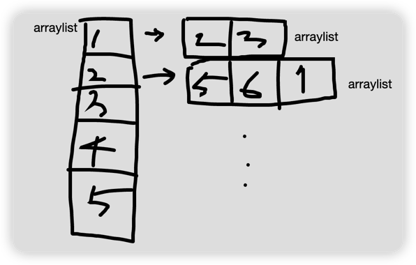

# 문제
[백준 11724번 - 연결 요소의 개수](https://www.acmicpc.net/problem/11724)

## 사용 알고리즘
- DFS 깊이 우선 탐색  
-> 처음 공부한 개념이라 강의 보고 품
- [참고 강의 - Do it! 알고리즘 with JAVA](https://www.inflearn.com/course/lecture?courseSlug=두잇-알고리즘-코딩테스트-자바&unitId=148352&tab=curriculum)

## 주의점
- 문제 해석  
`방향 없는 그래프가 주어졌을 때, 연결 요소 (Connected Component)의 개수를 구하는 프로그램을 작성하시오.`
  -> 연결 요소의 갯수란 노드끼리 연결이 끊어지지 않고 이어진 그래프의 갯수가 몇 개 인지, 즉 DFS 갯수

## 필드 개념
- `graph[][]` 
  1. [] 의 값 : []의 값은 arraylist (int 값이 따로 있는게 아님, 값이 arraylist) 
  `graph[1] = 1번노드의 arraylist` 처럼 arraylist를 지칭할때 사용  
  2. [][] 의 값 : []노드의 인접 노드 중 한 노드의 번호
  3. [] 의 인덱스 : 한 노드 번호
  
➡️ `graph[1][2]`는 1번 노드의 2번째 인접노드 번호가 출력됨

# 코드 구조
1. 노드 개수 n, 에지 개수 m 받음
2. 방문 노드인지 기록할 boolean 배열[n] 선언
2. 노드 개수 만큼 arraylist 선언
3. 위의 arraylist 각 요소에, 그 노드에 대한 인접 노드를 받을 arraylist 선언

- 1 노드에 인접 노드가 3일 때   
1 요소의 arraylist에도 3을 add 하고, 3 요소의 arraylist에도 1을 add 해야함 
4. n의 개수 만큼 for 문 
   (1) 방문하지 않은 노드 있으면 cnt++  
   (2) 그리고 i에 대한 DFS 함수 돌림
5. DFS 함수 구현 
   (1) 현재 노드가 방문 노드면 return 해서 함수 끝냄 
   -> 자동으로 이제부터 코드는 방문 노드 아닌 경우임 
   (2) 방문 배열에 true로 변경 
   (3) 현재 노드의 인접 노드 중 방문 아닌거 확인후, DFS 실행(재귀) 

➡️ 탐색 순서를 구할려면 다른 코드가 추가적으로 필요하겠지만,  
   여기선 DFS 갯수만 구하면 되므로, 모든 노드를 도는 것이 주목적

## 알게 된 것
- boolean 배열 선언 시, 기본 초기값은 false
- `ArrayList<Integer>[] a = new ArrayList[n];`
