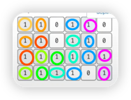

# 문제
- [백준 2178번 - 미로 탐색](https://www.acmicpc.net/problem/2178)

## 관련 알고리즘
- BFS - 너비 우선 탐색 
-> 처음으로 배운 개념이라 강의 보고 품
- 배열을 그래프로 생각하려면 아래 그림처럼 같은 색의 노드가 같은 깊이에 있다고 생각하기 
  (인접한 노드끼리 이어져 있다고 가정할 경우)

    

# 문제 idea

- 그림과 같이 배열에 거리 값을 넣어주면서 진행 
-> 그렇게 하면 진행이 끝났을 때 배열을 마지막 값이 거리 값   

- 먼저 시작 노드 삽입하고 시작, 방문했다고도 기록
- 큐에 삽입 전에 확인 사항 
  (1) 배열에서 벗어나지 않은 뱡향의 노드인지(유효한 좌표인지) 확인 
  (2) 1 이면서(이동할 수 있는지) and 방문하지 않은 노드인지 
- 확인 사항에 적합하면, 
  (1) 방문 했다고 바꾸고 
  (2) 새로갈 노드의 depth를 (현재 노드의 depth +1) 로 바꾸기  
  (3) 큐에 데이터 삽입하기

# 새로 알게 된 것 
- 띄어쓰기 없는 숫자 문자열(String)을 한 글자씩 배열(int[])에 담기 ("1234" 를 한 글자씩 int 배열로)  
-> `num = Stream.of(line.split("")).mapToInt(Integer::parseInt).toArray();` 
-> num 은 int 배열, line 은 띄어쓰기 없는 문자열

# 참고 강의
[Do it! 알고리즘 with JAVA](https://www.youtube.com/embed/2QVfsI55AVo?autoplay=1)  
-> BFS 메소드의 `visited[i][j]`가 반복되어 코드를 분석해보니,  
-> 초기값 (0,0)의 visited를 true로 바꾸기 위함인 것을 보고
-> main에서 처리해주는 걸로 변경